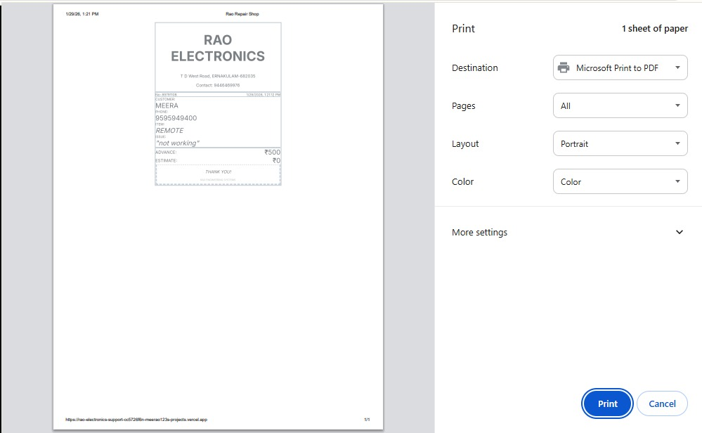
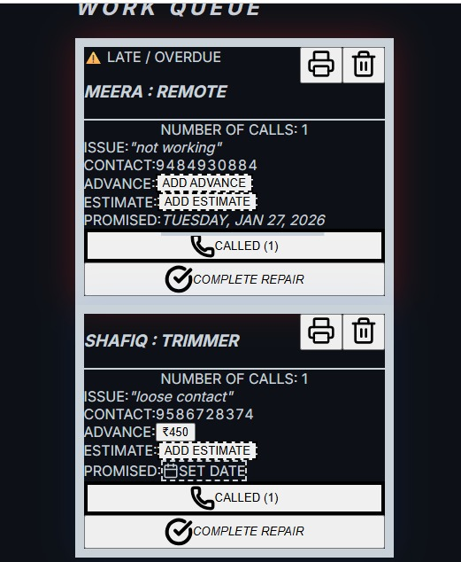
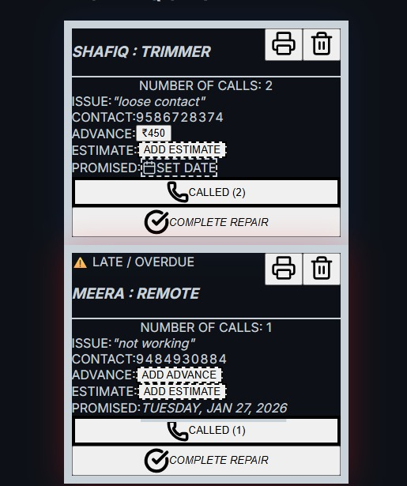
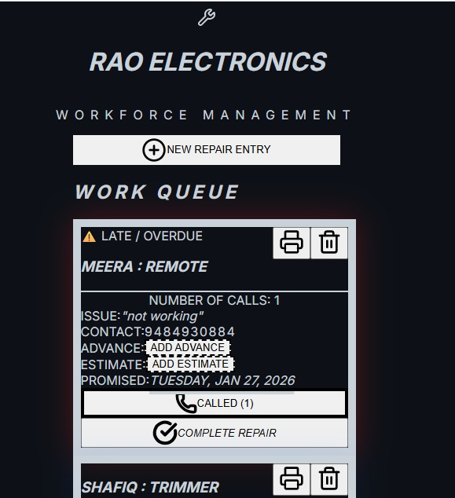
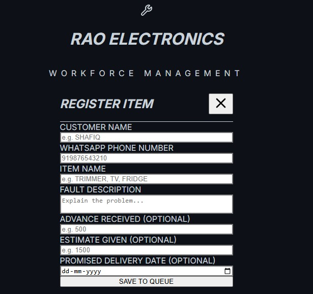
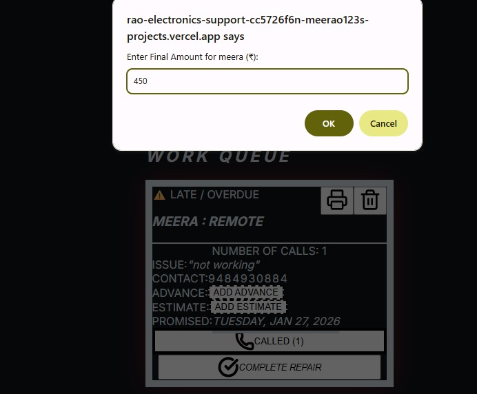

# 🛠️ Rao Electronics: Service Center Dashboard

A lightweight, fast Progressive Web App (PWA) built with **Next.js** to manage electronic repair workflows. Optimized for mobile touch, it features a high-contrast "Clean Card" design and automatically updated priority sorting.

## ✨ Features

### 🚀 Automated Priority Logic
- **Call-Based Bumping:** Repairs with the most customer follow-ups automatically jump to the top of the queue.
- **Dynamic Sorting:** Secondary sorting by promised delivery dates ensures deadlines are never missed.

### 💰 Financial Tracking
- **Advance & Estimates:** Integrated fields to track "Advance Received" and "Estimate Given" for every repair.
- **On-the-Fly Updates:** Add or modify financial details directly from the work cards without re-entering data.

### 🖨️ Professional Receipt Printing
- **One-Tap Receipt Generation:** Each work card includes a dedicated printer icon to instantly generate a customer receipt.
- **Smart Print-Only Layout:** Uses CSS print media queries to ensure only the receipt content is printed, automatically hiding the dashboard UI.
- **Auto-Filled Receipt Details:** Every receipt is dynamically populated with:
  - **Business Header:** RAO ELECTRONICS branding, shop address, and primary contact number
  - **Date & Time:** Automatically generated timestamp at print time
  - **Receipt Identifier:** A short, unique receipt number for easy physical filing
  - **Customer Details:** Customer name and phone number
  - **Service Information:** Item/device type and reported issue
  - **Financial Summary:** Advance received and estimated service cost (if provided)
- **Printer-Friendly Design:** High-contrast black-on-white layout optimized for thermal receipt printers and standard A4/A5 printing.

  

### 📱 Professional Mobile UI
- **Stark White Cards:** Every repair is isolated in a self-contained white box on a deep background for maximum readability.
- **Zero-Overlap Layout:** A strictly vertical, mechanical design ensures no elements ever touch or cover each other.
- **Finger-Friendly Controls:** Massive full-width buttons designed for fast, one-handed shop operations.

### 🔴 Visual Status Indicators
- **Persistent Border Logic:** Every card features a thick 10px border—Blue for active repairs and Red for overdue items.
- **Pulsing Overdue Alerts:** Late items display a bold `⚠️ LATE / OVERDUE` warning to drive immediate action.

### 💬 Integrated Notifications
- **WhatsApp Automation:** One-tap "Complete Repair" button generates a professionally formatted pickup message.
- **Auto-Cleaning Phone Numbers:** Strips non-digit characters to ensure 100% compatibility with the WhatsApp API.

---

## 🔗 Live Deployment

This application is deployed on Vercel.

⚠️ **Note:** This is a production system designed for a specific business. Access is restricted, and the app is not intended for public demo use.

**Live URL:** https://rao-electronics-support-cc5726f6n-meerao123s-projects.vercel.app/

---

## 📸 App Preview

| Work Queue | Priority Listing | Overdue Repairs |
| :---: | :---: | :---: |
|  |  |  |

| Register New Item | Financial Entry | WhatsApp Notification |
| :---: | :---: | :---: |
|  |  |  |

| Receipt Printing |
| :---: |
|  |


---

## 🛠️ Tech Stack

- **Framework:** Next.js (App Router)
- **Styling:** Tailwind CSS
- **Icons:** Lucide React
- **Persistence:** Browser `LocalStorage` (Data stays safe on your device without a server)
- **Deployment:** Optimized for Vercel

---

## 🚀 Getting Started

### Installation
1. **Clone the repository:**
   ```bash
   git clone https://github.com/meerao123/rao-electronics
   cd repair-shop-pwa
   ```
2. **Install dependencies:**
   ```bash
   npm install
   ```
3. **Run the development server:**
   ```bash
   npm run dev -- -p 3005
   ```
   *Dashboard available at `http://localhost:3005`*

---

## 🏗️ Operational Logic

### Sorting Hierarchy
1. **Call Count:** Items with more customer calls are moved to the top.
2. **Promised Date:** For items with equal calls, the one with the earlier deadline comes first.
3. **No Date:** Unscheduled items are placed at the bottom within their call-count group.

### Data Security
This app is designed for local-first reliability.
- **Storage:** Data is stored in the browser's `LocalStorage`.
- **Note:** Data entered on one device (e.g., a laptop) will not automatically appear on another (e.g., a phone). For shop use, it is recommended to use one dedicated management device.

---
*Built specifically for Rao Electronics workforce management.*
